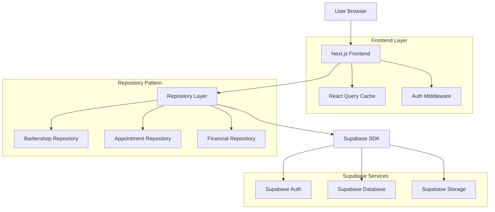
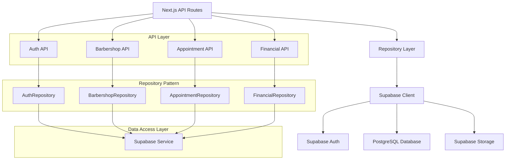
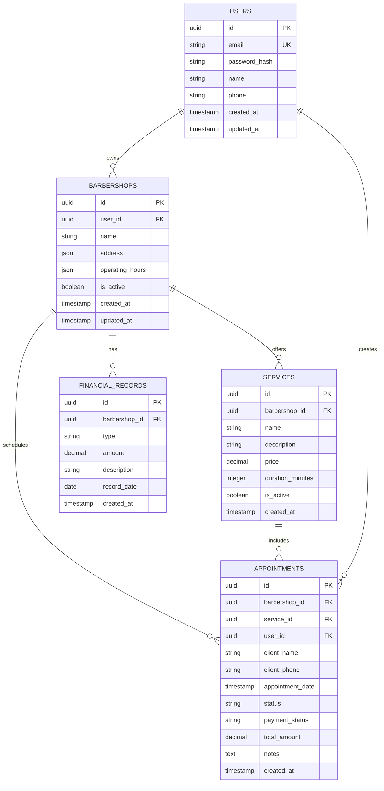

## 1. Architecture design



## 2. Technology Description

- **Frontend**: Next.js 14 + TypeScript + Tailwind CSS
- **Initialization Tool**: create-next-app
- **Backend**: Supabase (BaaS)
- **Cache**: React Query (TanStack Query)
- **UI Components**: Headless UI + Radix UI
- **Charts**: Chart.js + react-chartjs-2
- **Forms**: React Hook Form + Zod
- **Testing**: Jest + React Testing Library + Cypress
- **Internationalization**: next-i18next

## 3. Route definitions

| Route | Purpose |
|-------|---------|
| / | Landing page com call-to-action para login |
| /auth/login | Página de login com formulário de autenticação |
| /auth/register | Registro de novos usuários |
| /auth/recovery | Recuperação de senha via email |
| /setup/wizard | Wizard de configuração inicial da barbearia |
| /dashboard | Dashboard principal com métricas e visão geral |
| /appointments | Gerenciamento de agendamentos e calendário |
| /appointments/[id] | Detalhes e edição de agendamento específico |
| /financial/reports | Relatórios financeiros e análises |
| /financial/commissions | Controle de comissões e pagamentos |
| /settings/business | Configurações da barbearia |
| /settings/services | Gerenciamento de serviços e preços |
| /settings/profile | Perfil do usuário barbeiro |

## 4. API definitions

### 4.1 Authentication APIs

```
POST /api/auth/register
```

Request:
| Param Name | Param Type | isRequired | Description |
|------------|------------|------------|-------------|
| email | string | true | Email do barbeiro |
| password | string | true | Senha (mínimo 8 caracteres) |
| name | string | true | Nome completo |
| phone | string | false | Telefone de contato |

Response:
| Param Name | Param Type | Description |
|------------|------------|-------------|
| user | object | Dados do usuário criado |
| session | object | Sessão JWT e refresh token |

### 4.2 Barbershop APIs

```
GET /api/barbershop/info
```

Headers: `Authorization: Bearer {jwt_token}`

Response:
| Param Name | Param Type | Description |
|------------|------------|-------------|
| id | string | ID da barbearia |
| name | string | Nome da barbearia |
| address | object | Endereço completo |
| operatingHours | array | Horários de funcionamento |
| services | array | Lista de serviços oferecidos |

### 4.3 Appointment APIs

```
POST /api/appointments/create
```

Request:
| Param Name | Param Type | isRequired | Description |
|------------|------------|------------|-------------|
| clientName | string | true | Nome do cliente |
| clientPhone | string | true | Telefone do cliente |
| serviceId | string | true | ID do serviço |
| dateTime | string | true | Data e horário do agendamento |
| notes | string | false | Observações adicionais |

## 5. Server architecture diagram



## 6. Data model

### 6.1 Data model definition



### 6.2 Data Definition Language

**Users Table**
```sql
CREATE TABLE users (
    id UUID PRIMARY KEY DEFAULT gen_random_uuid(),
    email VARCHAR(255) UNIQUE NOT NULL,
    password_hash VARCHAR(255) NOT NULL,
    name VARCHAR(100) NOT NULL,
    phone VARCHAR(20),
    created_at TIMESTAMP WITH TIME ZONE DEFAULT NOW(),
    updated_at TIMESTAMP WITH TIME ZONE DEFAULT NOW()
);

-- Enable Row Level Security
ALTER TABLE users ENABLE ROW LEVEL SECURITY;

-- Create policies
CREATE POLICY "Users can view own profile" ON users FOR SELECT USING (auth.uid() = id);
CREATE POLICY "Users can update own profile" ON users FOR UPDATE USING (auth.uid() = id);
```

**Barbershops Table**
```sql
CREATE TABLE barbershops (
    id UUID PRIMARY KEY DEFAULT gen_random_uuid(),
    user_id UUID REFERENCES users(id) ON DELETE CASCADE,
    name VARCHAR(200) NOT NULL,
    address JSONB NOT NULL,
    operating_hours JSONB NOT NULL DEFAULT '[{"day": "monday", "open": "09:00", "close": "18:00", "closed": false}]',
    is_active BOOLEAN DEFAULT true,
    created_at TIMESTAMP WITH TIME ZONE DEFAULT NOW(),
    updated_at TIMESTAMP WITH TIME ZONE DEFAULT NOW()
);

-- Indexes
CREATE INDEX idx_barbershops_user_id ON barbershops(user_id);

-- RLS Policies
ALTER TABLE barbershops ENABLE ROW LEVEL SECURITY;
CREATE POLICY "Users can manage own barbershop" ON barbershops FOR ALL USING (auth.uid() = user_id);
```

**Services Table**
```sql
CREATE TABLE services (
    id UUID PRIMARY KEY DEFAULT gen_random_uuid(),
    barbershop_id UUID REFERENCES barbershops(id) ON DELETE CASCADE,
    name VARCHAR(100) NOT NULL,
    description TEXT,
    price DECIMAL(10,2) NOT NULL,
    duration_minutes INTEGER NOT NULL,
    is_active BOOLEAN DEFAULT true,
    created_at TIMESTAMP WITH TIME ZONE DEFAULT NOW(),
    updated_at TIMESTAMP WITH TIME ZONE DEFAULT NOW()
);

-- Indexes
CREATE INDEX idx_services_barbershop_id ON services(barbershop_id);

-- RLS Policies
ALTER TABLE services ENABLE ROW LEVEL SECURITY;
CREATE POLICY "Users can manage services from own barbershop" ON services FOR ALL USING (
    barbershop_id IN (SELECT id FROM barbershops WHERE user_id = auth.uid())
);
```

**Appointments Table**
```sql
CREATE TABLE appointments (
    id UUID PRIMARY KEY DEFAULT gen_random_uuid(),
    barbershop_id UUID REFERENCES barbershops(id) ON DELETE CASCADE,
    service_id UUID REFERENCES services(id) ON DELETE CASCADE,
    user_id UUID REFERENCES users(id) ON DELETE CASCADE,
    client_name VARCHAR(100) NOT NULL,
    client_phone VARCHAR(20) NOT NULL,
    appointment_date TIMESTAMP WITH TIME ZONE NOT NULL,
    status VARCHAR(20) DEFAULT 'scheduled' CHECK (status IN ('scheduled', 'confirmed', 'completed', 'cancelled')),
    payment_status VARCHAR(20) DEFAULT 'pending' CHECK (payment_status IN ('pending', 'paid', 'partial', 'refunded')),
    total_amount DECIMAL(10,2) NOT NULL,
    notes TEXT,
    created_at TIMESTAMP WITH TIME ZONE DEFAULT NOW(),
    updated_at TIMESTAMP WITH TIME ZONE DEFAULT NOW()
);

-- Indexes
CREATE INDEX idx_appointments_barbershop_id ON appointments(barbershop_id);
CREATE INDEX idx_appointments_date ON appointments(appointment_date);
CREATE INDEX idx_appointments_status ON appointments(status);

-- RLS Policies
ALTER TABLE appointments ENABLE ROW LEVEL SECURITY;
CREATE POLICY "Users can manage appointments from own barbershop" ON appointments FOR ALL USING (
    barbershop_id IN (SELECT id FROM barbershops WHERE user_id = auth.uid())
);
```

### 6.3 Repository Pattern Implementation

**Base Repository Interface**
```typescript
interface IRepository<T> {
  findById(id: string): Promise<T | null>;
  findAll(filters?: Record<string, any>): Promise<T[]>;
  create(data: Partial<T>): Promise<T>;
  update(id: string, data: Partial<T>): Promise<T>;
  delete(id: string): Promise<boolean>;
}

// Supabase Repository Implementation
class SupabaseRepository<T> implements IRepository<T> {
  protected tableName: string;
  protected client: SupabaseClient;
  
  constructor(tableName: string, client: SupabaseClient) {
    this.tableName = tableName;
    this.client = client;
  }
  
  async findById(id: string): Promise<T | null> {
    const { data, error } = await this.client
      .from(this.tableName)
      .select('*')
      .eq('id', id)
      .single();
      
    if (error) throw new Error(error.message);
    return data;
  }
  
  // Additional methods implementation...
}
```

## 7. Testing Strategy

### 7.1 Unit Tests (Jest + React Testing Library)
- Componentes React com 100% de cobertura
- Funções utilitárias e helpers
- Validações de formulário com Zod
- Cálculos financeiros e comissões

### 7.2 Integration Tests (Cypress)
- Fluxo completo de autenticação
- Wizard de configuração inicial
- CRUD de agendamentos
- Geração de relatórios financeiros
- Exportação de dados

### 7.3 Performance Tests
- Lighthouse CI para métricas de performance
- Testes de carga com k6 ou Artillery
- Monitoramento de bundle size
- Análise de Core Web Vitals

## 8. CI/CD Pipeline

### 8.1 GitHub Actions Workflow
```yaml
name: CI/CD Pipeline

on:
  push:
    branches: [main, develop]
  pull_request:
    branches: [main]

jobs:
  test:
    runs-on: ubuntu-latest
    steps:
      - uses: actions/checkout@v3
      - name: Setup Node.js
        uses: actions/setup-node@v3
        with:
          node-version: '18'
          cache: 'npm'
      - run: npm ci
      - run: npm run lint
      - run: npm run test:unit -- --coverage
      - run: npm run test:integration
      - run: npm run build
      
  deploy:
    needs: test
    runs-on: ubuntu-latest
    if: github.ref == 'refs/heads/main'
    steps:
      - uses: actions/checkout@v3
      - name: Deploy to Vercel
        uses: amondnet/vercel-action@v25
        with:
          vercel-token: ${{ secrets.VERCEL_TOKEN }}
          vercel-org-id: ${{ secrets.ORG_ID }}
          vercel-project-id: ${{ secrets.PROJECT_ID }}
```

### 8.2 Environment Variables
```env
# Supabase
NEXT_PUBLIC_SUPABASE_URL=
NEXT_PUBLIC_SUPABASE_ANON_KEY=
SUPABASE_SERVICE_ROLE_KEY=

# Application
NEXT_PUBLIC_APP_URL=
NEXT_PUBLIC_APP_NAME="Meu Barbeiro"
JWT_SECRET=

# Email Service
SMTP_HOST=
SMTP_PORT=
SMTP_USER=
SMTP_PASSWORD=
```

## 9. Deployment Configuration

### 9.1 Vercel Configuration (vercel.json)
```json
{
  "buildCommand": "npm run build",
  "outputDirectory": ".next",
  "devCommand": "npm run dev",
  "installCommand": "npm install",
  "framework": "nextjs",
  "regions": ["gru1"],
  "functions": {
    "pages/api/**/*.ts": {
      "maxDuration": 10
    }
  }
}
```

### 9.2 Performance Optimization
- **Images**: Next.js Image component com otimização automática
- **Fonts**: Fontes otimizadas do Google Fonts
- **Scripts**: Lazy loading para scripts de terceiros
- **Analytics**: Google Analytics 4 com modo de compatibilidade
- **SEO**: Meta tags dinâmicas e sitemap automático