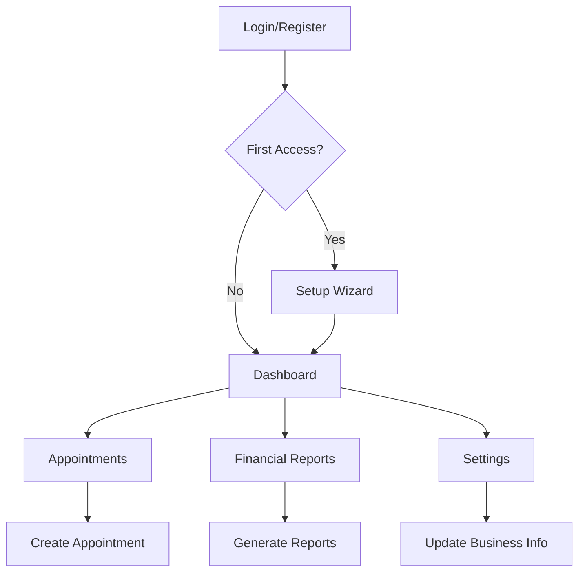

## 1. Product Overview
Sistema gerencial completo para barbearias que automatiza agendamentos, gestão financeira e controle de atendimentos. Resolve problemas de organização de horários, controle de receitas e gestão de clientes para barbeiros independentes e barbearias.

Permite que barbeiros gerenciem seus negócios de forma profissional, com dashboard financeiro, controle de comissões e análise de performance, aumentando a eficiência operacional e rentabilidade do negócio.

## 2. Core Features

### 2.1 User Roles
| Role | Registration Method | Core Permissions |
|------|---------------------|------------------|
| Barbeiro/Owner | Email registration with wizard setup | Full access to all modules and settings |
| Cliente | Phone/email via booking | View available slots, book appointments |

### 2.2 Feature Module
Nosso sistema de gestão para barbearias consiste nos seguintes módulos principais:

1. **Página de Autenticação**: Login, registro, recuperação de senha e wizard de configuração inicial
2. **Dashboard Principal**: Visão geral do negócio, métricas financeiras e agenda de hoje
3. **Módulo de Atendimentos**: Agendamento, cancelamento, histórico e status de pagamento
4. **Módulo Financeiro**: Relatórios de receita, despesas, comissões e exportação de dados
5. **Módulo de Configurações**: Gerenciamento da barbearia, serviços, horários e preferências

### 2.3 Page Details
| Page Name | Module Name | Feature description |
|-----------|-------------|---------------------|
| Login | Authentication | Validar credenciais, redirecionar para dashboard ou wizard setup |
| Register | Authentication | Criar conta com email/senha, iniciar wizard de configuração |
| Password Recovery | Authentication | Enviar email com link para redefinição de senha |
| Setup Wizard | Onboarding | Coletar informações da barbearia: nome, endereço, horários, serviços e preços |
| Dashboard | Overview | Exibir receita do dia/mês, próximos atendimentos, gráficos de tendência |
| Appointments | Scheduling | Criar/editar/cancelar agendamentos, visualizar calendário, definir status de pagamento |
| Financial Reports | Finance | Gerar relatórios mensais, analisar serviços mais lucrativos, controlar despesas |
| Settings | Configuration | Editar informações da barbearia, gerenciar serviços e preços, definir horários de funcionamento |

## 3. Core Process

### Fluxo do Barbeiro:
1. Acessa página de registro e cria conta
2. Completa wizard de configuração com dados da barbearia
3. Acessa dashboard principal para ver visão geral
4. Gerencia agendamentos na página de atendimentos
5. Acompanha métricas financeiras e gera relatórios
6. Ajusta configurações conforme necessário

### Fluxo do Cliente:
1. Visualiza horários disponíveis (via link compartilhado)
2. Realiza agendamento com dados pessoais
3. Recebe confirmação e lembretes

## 4. User Interface Design

### 4.1 Design Style
- **Cores Primárias**: Azul profissional (#1E40AF) e cinza escuro (#374151)
- **Cores Secundárias**: Verde para sucesso (#10B981), vermelho para alertas (#EF4444)
- **Botões**: Estilo arredondado com sombra sutil, hover effects suaves
- **Fontes**: Inter para textos, Poppins para títulos (16px base, 14px mobile)
- **Layout**: Card-based com navegação lateral, design clean e minimalista
- **Ícones**: Feather Icons ou Heroicons em estilo outline

### 4.2 Page Design Overview
| Page Name | Module Name | UI Elements |
|-----------|-------------|-------------|
| Login | Auth Form | Fundo gradiente, card central branco com sombra, inputs com bordas arredondadas, botão primário azul |
| Dashboard | Metrics Cards | Grid de cards com estatísticas, gráficos Chart.js, calendário interativo, paleta de cores profissional |
| Appointments | Calendar View | Calendário mensal/semanal, modal para novo agendamento, lista de agendamentos com status colorido |
| Financial | Reports | Tabelas responsivas, gráficos de barras/linhas, filtros por período, botões de exportação |
| Settings | Forms | Formulários multi-etapas, toggle switches, upload de logo, preview em tempo real |

### 4.3 Responsiveness
- Abordagem mobile-first com breakpoints em 640px, 768px, 1024px
- Menu hamburger em mobile, sidebar collapsível em tablet
- Touch-optimized com áreas de clique mínimas de 44px
- Scroll suave e transições otimizadas para dispositivos móveis

### 4.4 Performance Requirements
- Tempo de carregamento inicial < 3 segundos
- Implementação de lazy loading para imagens e componentes
- Cache agressivo com React Query/SWR
- Bundle size otimizado com code splitting